<div align="center">

# Jigyasa: Empowering Rural Education, Together

**Jigyasa is a comprehensive web platform designed to bridge the educational gap in rural areas. It connects dedicated volunteers with underserved schools, providing a streamlined system for coordination, resource sharing, and impact tracking. Our mission is to empower rural communities and make quality education accessible to every child.**

<p>
  <a href="https://jigyasa-dhadpad.netlify.app/" target="_blank"><strong>Live Demo</strong></a> •
  <a href="https://github.com/adarshdhakar/jigyasa" target="_blank"><strong>GitHub Repository</strong></a> •
  <a href="https://drive.google.com/drive/folders/1vHkihWCgtLYx28RkCIONgxRNhwB21k_h?usp=drive_link " target="_blank"><strong>Project Resources</strong></a>
</p>

<p>
  
  
  
</p>

</div>

---

## Project Resources
* **Project Presentation:** <a href="https://drive.google.com/file/d/1vBvCdWkXvNg2BgtiKSavjRGJim3-jAdR/view?usp=sharing" target="_blank"><strong>Link</strong></a> 
* **Prompt Handbook:** <a href="https://drive.google.com/file/d/1W6V--GSeMNJ2MI_3ejfPdf-n6LPs-eSb/view?usp=sharing" target="_blank"><strong>Link</strong></a> 
* **Demo Video:** <a href="https://drive.google.com/file/d/1le48j3RKonGDoi7Fcg_R0WBnZskmQsZf/view?usp=sharing" target="_blank"><strong>Link</strong></a>
---

## Tech Stack
This project is built using the MERN stack and other modern web technologies to deliver a robust and scalable solution.

| Category           | Technologies                                                                                                                                                                                                                                                                                                                                                        |
| ------------------ | ------------------------------------------------------------------------------------------------------------------------------------------------------------------------------------------------------------------------------------------------------------------------------------------------------------------------------------------------------------------- |
| **Frontend** |                                                |
| **Backend** |                                                                                                                                                 |
| **Database** |                                                                                                                                                                                                                                                                |
| **Authentication** |                                                                                                                                                                                                                                                                  |
| **File Storage** |                                                                                                                                                                                                                                                     |
| **Other Tools** |                                                                                                                                                                                        |

---

## Key Features
Jigyasa is packed with features designed to facilitate a seamless experience for administrators, volunteers, and schools.

| 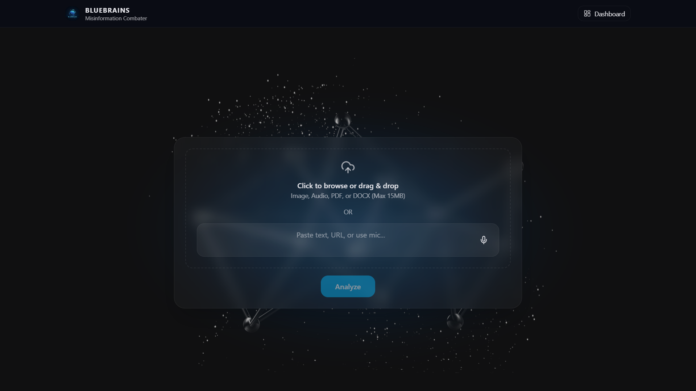 | 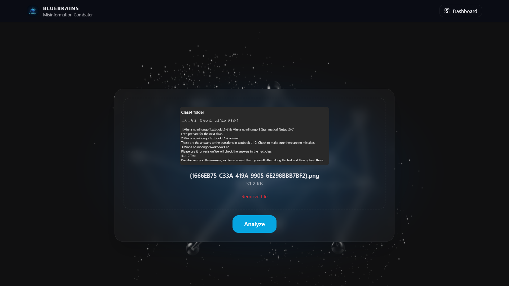 |
|--------------------------------|--------------------------------|

### 🎨 Enhanced User Experience
A customizable **light/dark mode** interface coupled with **multilingual support** (English, हिंदी, मराठी) ensures the platform is accessible and user-friendly for everyone.
| 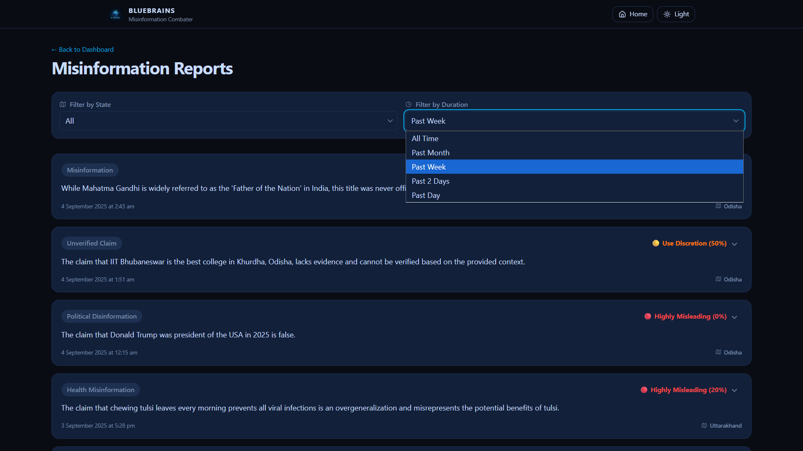 |  |
|--------------------------------|--------------------------------|

<p align="center">
  
</p>
<br/>

### 👨‍🏫 Volunteer Management
Features a streamlined volunteer **application and onboarding process**. A comprehensive dashboard allows for tracking personnel statistics and performance.
<br/>
| 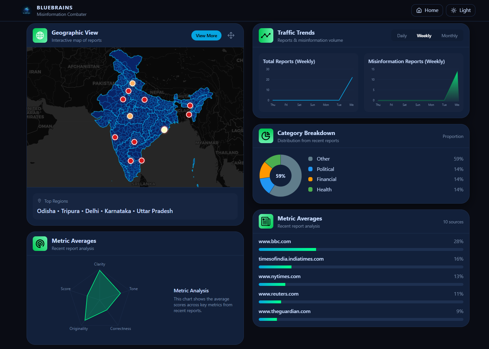 | 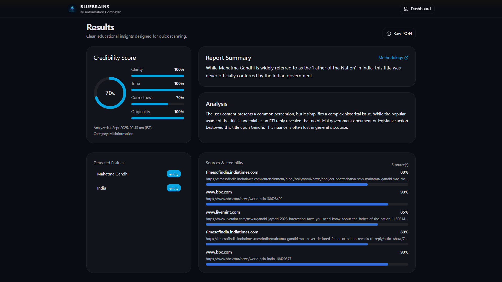 |
|--------------------------------|--------------------------------|
| 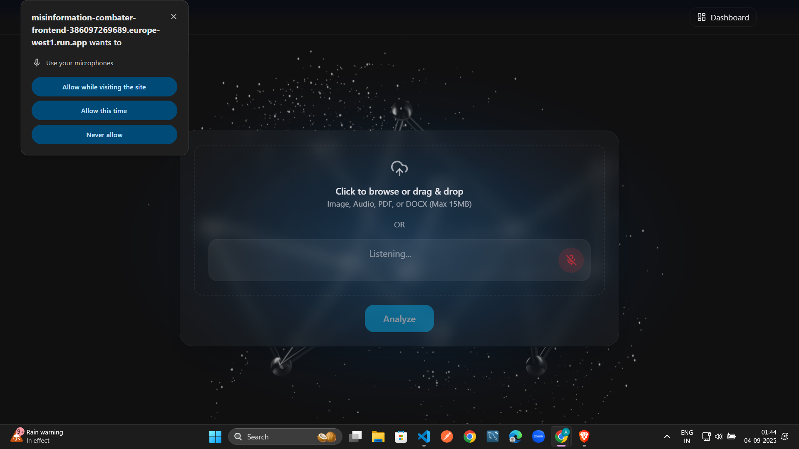 | 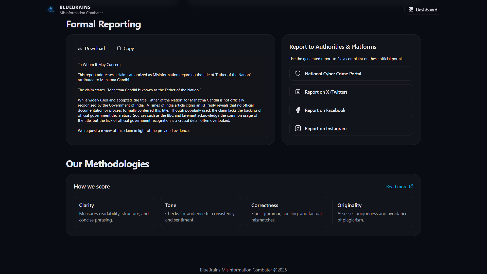 |

<br/>

### 📚 Centralized Educational Resources
Access **chapter-wise organized quizzes and educational videos** for various grade levels, allowing volunteers to deliver structured and effective lessons.
<br/>
| 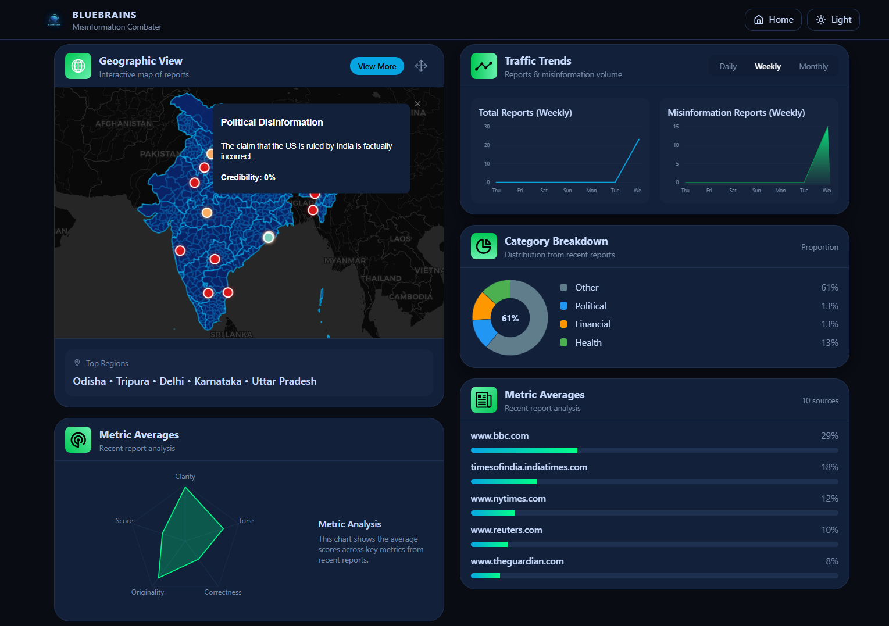 | 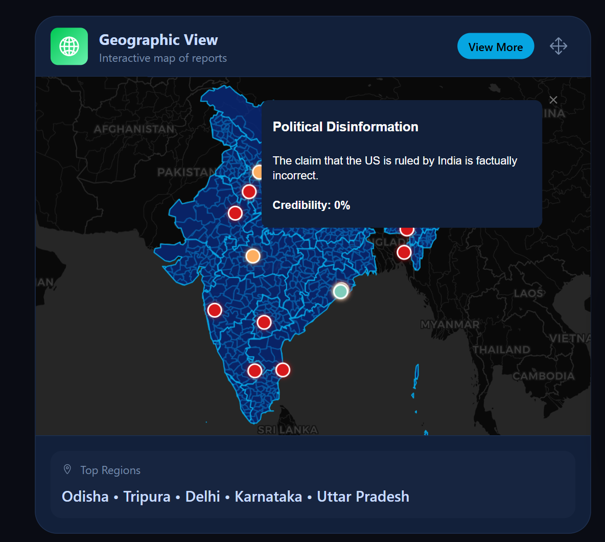 |
|--------------------------------|--------------------------------|

### 🏫 Smart School Assignment System
An intelligent allocation system assigns volunteers to schools, with a policy of a **maximum of five schools per volunteer** and one volunteer per school to ensure focused attention.
<br/>


### ⚙️ Robust Admin Controls
A centralized admin dashboard provides powerful tools for **managing volunteers, uploading resources, and viewing detailed analytics**.
<br/>
|  |  |
|--------------------------------|--------------------------------|
| 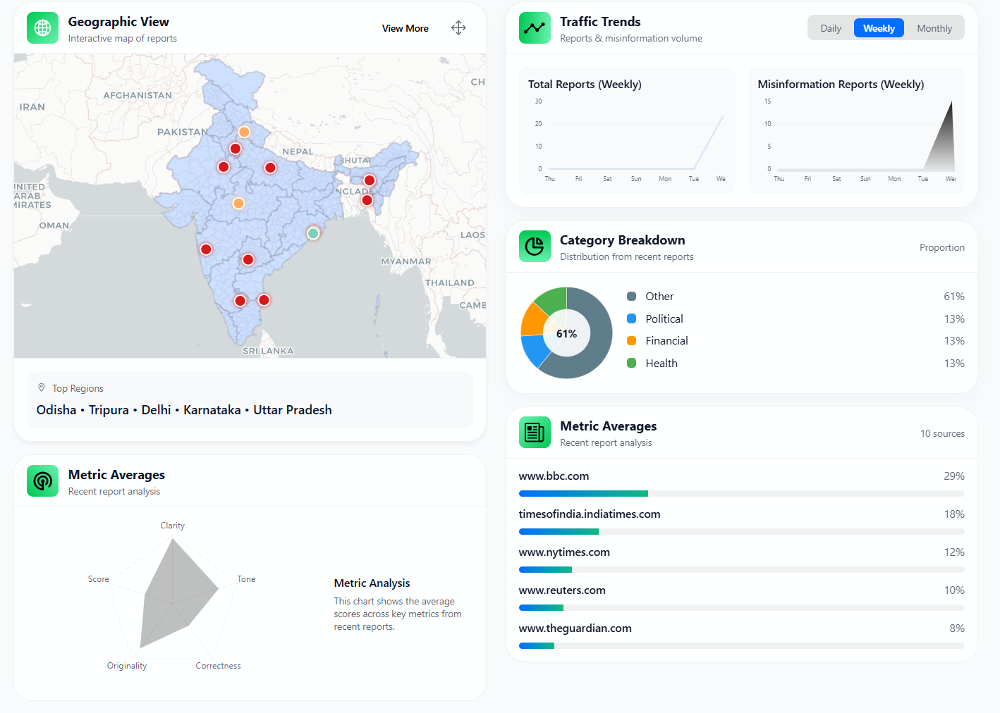 | 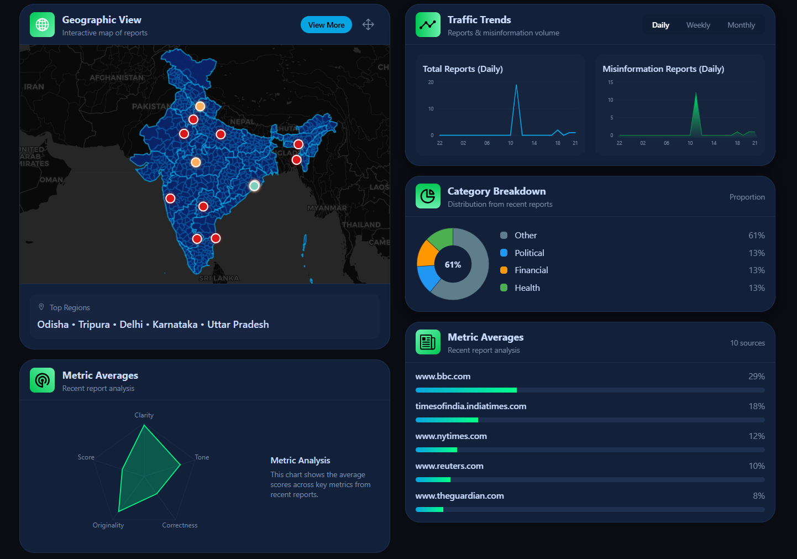 |
<p align="center">
  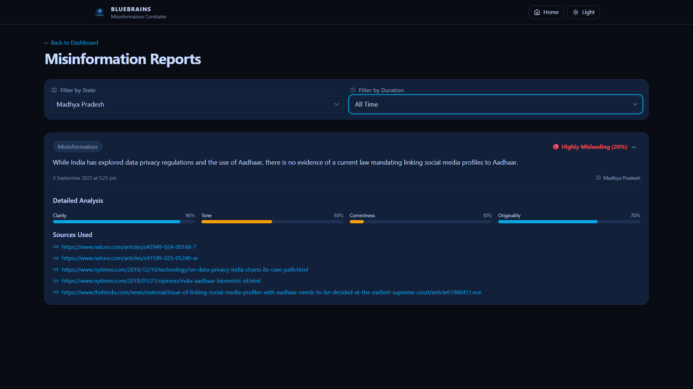
</p>

---

## Project Structure
The project is organized as a monorepo with two main directories:

-   `/api`: Contains the entire backend Node.js and Express application.
-   `/client`: Contains the entire frontend React application.

```
    ├── api/
    │   ├── config/
    │   ├── controllers/
    │   ├── models/
    │   ├── routes/
    │   ├── services/
    │   ├── index.js
    │   └── package.json
    └── client/
        ├── public/
        ├── src/
        ├── index.html
        └── package.json
```

---

## Getting Started
Follow these instructions to set up and run the project on your local machine for development and testing purposes.

### Prerequisites
Make sure you have the following software installed on your system:
* [Node.js](https://nodejs.org/) (v18 or later)
* [npm](https://www.npmjs.com/) (or yarn)
* [Git](https://git-scm.com/)
* [MongoDB](https://www.mongodb.com/) (You can use a local instance or a cloud service like MongoDB Atlas)

### Local Installation & Setup

1.  **Clone the Repository**
    ```sh
    git clone https://github.com/adarshdhakar/jigyasa.git
    cd jigyasa
    ```

2.  **Set Up the Backend (`/api`)**
    * Navigate to the backend directory:
        ```sh
        cd api
        ```
    * Install the required dependencies:
        ```sh
        npm install
        ```
    * Create a `.env` file in the `/api` directory and add the following environment variables. Replace the placeholder values with your actual credentials.
        ```env
        PORT=5000
        ATLASDB_URL=<Your_MongoDB_Connection_String>
        SECRET=<Your_Super_Secret_Key>
        CLOUDINARY_CLOUD_NAME=<Your_Cloudinary_Cloud_Name>
        CLOUDINARY_API_KEY=<Your_Cloudinary_API_Key>
        CLOUDINARY_API_SECRET=<Your_Cloudinary_API_Secret>
        EMAIL_USER=<Your_Email_Address_for_Nodemailer>
        EMAIL_PASS=<Your_Email_Password_or_App_Password>
        JWT_SECRET=<Your_JWT_Secret_Key>
        ```
    * Start the backend server:
        ```sh
        nodemon index.js
        ```
    * The server should now be running on `http://localhost:5000`.

3.  **Set Up the Frontend (`/client`)**
    * Open a new terminal and navigate to the frontend directory from the root folder:
        ```sh
        cd client
        ```
    * Install the required dependencies:
        ```sh
        npm install
        ```
    * Start the frontend development server:
        ```sh
        npm run dev
        ```
    * The React application will open and run on `http://localhost:5173`.

You can now access the application in your browser and start exploring!

---

## Contributing
Contributions are what make the open-source community such an amazing place to learn, inspire, and create. Any contributions you make are **greatly appreciated**.

1.  Fork the Project
2.  Create your Feature Branch (`git checkout -b feature/AmazingFeature`)
3.  Commit your Changes (`git commit -m 'Add some AmazingFeature'`)
4.  Push to the Branch (`git push origin feature/AmazingFeature`)
5.  Open a Pull Request

---
